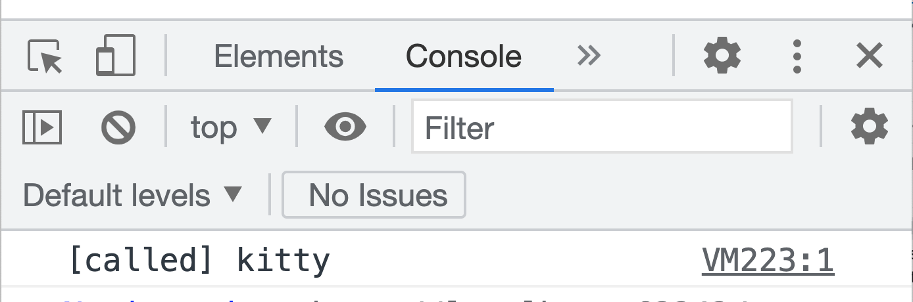
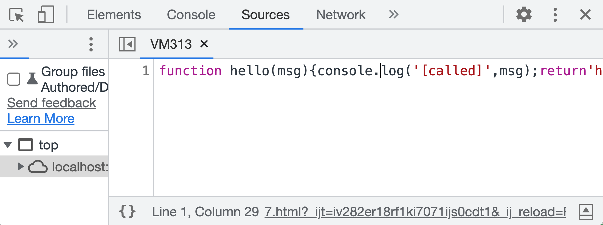
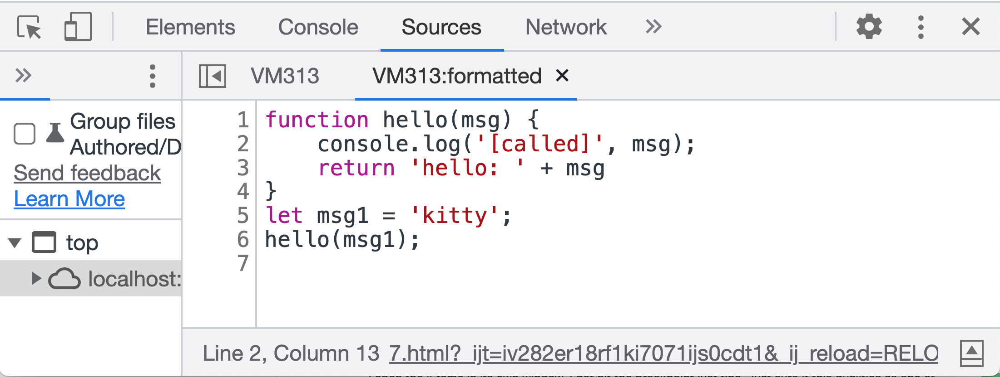

# JS混淆加密后如何分析

## 1、源代码

```javascript
function hello(msg) {
    console.log('[called]', msg);
    return 'hello: ' + msg;
}

let msg1 = 'kitty';
hello(msg1);
```

## 2、对上述源代码加密
- 混淆加密网站[https://tool.chinaz.com/js.aspx](https://tool.chinaz.com/js.aspx)
- 选择`加密压缩`
```javascript
// 加密压缩后的结果
eval(function(p,a,c,k,e,d){e=function(c){return(c<a?"":e(parseInt(c/a)))+((c=c%a)>35?String.fromCharCode(c+29):c.toString(36))};if(!''.replace(/^/,String)){while(c--)d[e(c)]=k[c]||e(c);k=[function(e){return d[e]}];e=function(){return'\\w+'};c=1;};while(c--)if(k[c])p=p.replace(new RegExp('\\b'+e(c)+'\\b','g'),k[c]);return p;}('5 0(1){4.3(\'[6]\',1);9\'0: \'+1}7 2=\'8\';0(2);',10,10,'hello|msg|msg1|log|console|function|called|let|kitty|return'.split('|'),0,{}))
```

```javascript
// 加密压缩后的结果格式化（对上面的代码格式化）
eval(function (p, a, c, k, e, d) {
    e = function (c) {
        return (c < a ? "" : e(parseInt(c / a))) + ((c = c % a) > 35 ? String.fromCharCode(c + 29) : c.toString(36))
    };
    if (!''.replace(/^/, String)) {
        while (c--) d[e(c)] = k[c] || e(c);
        k = [function (e) {
            return d[e]
        }];
        e = function () {
            return '\\w+'
        };
        c = 1;
    }
    ;
    while (c--) if (k[c]) p = p.replace(new RegExp('\\b' + e(c) + '\\b', 'g'), k[c]);
    return p;
}('5 0(1){4.3(\'[6]\',1);9\'0: \'+1}7 2=\'8\';0(2);', 10, 10, 'hello|msg|msg1|log|console|function|called|let|kitty|return'.split('|'), 0, {}))
```

如果看到eval里的代码，全是乱的，`没关系`


## 2、分析出源代码
- 上面的eval执行后，实际在执行Javascript虚拟机里会生成源代码`一字不差`
- 如果eval执行后控制台有打印，则会显示如下



- 点击图中`VMxxx:yy`得到`真实的`源码



- 点击图中`{}`得到`格式化后的`源码



- 到此已经全部结束

## 总结
- 对于一般混淆加密的代码会使用：
```code
1、压缩代码
2、混淆（替换变量等）
3、加密（使用循环把代码拆分成字符串，然后替换成不可读但可`通过evel`执行的代码）
```

- 不管什么代码，`Javascript VM`会解析成`真实`源码，只要想办法拿到`Javascript VM`数据即可

